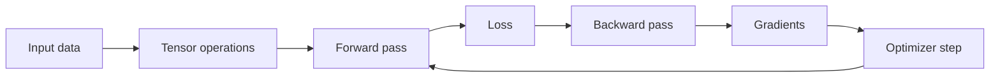
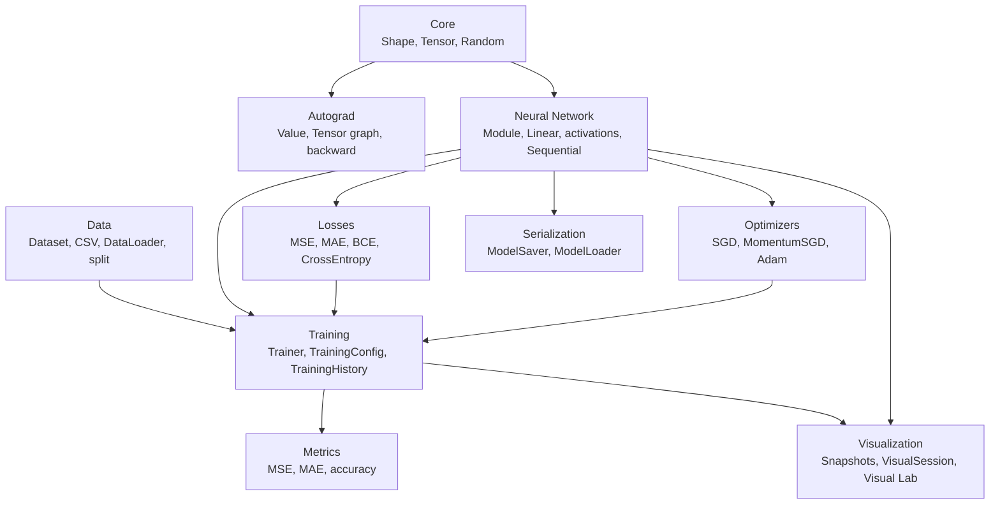

# NeuroForge

> A small CPU-only machine learning framework written from scratch in modern C++.

NeuroForge is an educational, PyTorch-inspired framework for building, training, evaluating, saving, loading, and visualizing small neural networks. It implements the important machinery directly: tensors, matrix multiplication, backpropagation, autograd, layers, losses, optimizers, datasets, training loops, serialization, and a desktop Visual Lab.

The goal is not to replace a production ML library. The goal is to make the internals visible and understandable.

## At A Glance

| | |
| --- | --- |
| Language | C++20 |
| Build system | CMake 3.20+ and Make shortcuts |
| Compute | CPU-only |
| Tensor scope | Rank-1 and rank-2 tensors |
| Dependencies | Core framework has no external ML dependency |
| Tests | 12 deterministic test executables |
| Demos | XOR, CSV linear regression, dense classification |
| Optional desktop UI | Dear ImGui + ImPlot + GLFW Visual Lab |



## Why This Project Exists

Using a mature ML library is easy. Understanding what happens inside one is harder.

NeuroForge keeps the system deliberately small so the full training path can be followed:

```text
data -> Tensor -> Sequential model -> loss -> backward -> optimizer -> improved predictions
```

It is suitable for small educational models such as XOR, linear regression, and dense 2D classification.

## Feature Matrix

| Module | Implemented |
| --- | --- |
| Core math | `Shape`, `Tensor`, indexing, factories, element-wise operations, transpose, matrix multiplication, reductions, activations, row-wise softmax |
| Autograd | Scalar `Value` engine, Tensor computation graphs, gradient accumulation, `backward()` |
| Neural networks | `Parameter`, `Module`, `Linear`, `ReLU`, `LeakyReLU`, `Sigmoid`, `Tanh`, `Softmax`, `Dropout`, `Sequential` |
| Losses | `MSELoss`, `MAELoss`, `BinaryCrossEntropyLoss`, `CrossEntropyLoss` |
| Optimizers | `SGD`, `MomentumSGD`, `Adam` |
| Training | Manual backward training, autograd training, `DataLoader` batches, evaluation loss, training history |
| Data | `Dataset`, strict numeric `CSVDataset`, `Batch`, `DataLoader`, train/test split |
| Metrics | MSE, MAE, multiclass accuracy, binary accuracy |
| Serialization | Text-based save/load for supported `Sequential` models |
| Visualization | Optional desktop XOR dashboard with a neuron graph, convergence curve, decision regions, and prediction table |

## Quick Start

Clone the repository and run the full validation:

```bash
git clone https://github.com/GeorgiMPastrakov/NeuroForge.git
cd NeuroForge
make validate
```

That command:

1. Builds the core framework.
2. Runs all automated tests.
3. Runs all command-line examples.
4. Builds the optional Visual Lab.
5. Scans source files for comments.
6. Prints the Git working tree status.

### Command Shortcuts

| Command | Purpose |
| --- | --- |
| `make build` | Configure and build the default framework |
| `make test` | Build and run all automated tests |
| `make examples` | Build and run all command-line demos |
| `make visual` | Build the optional Visual Lab |
| `make run-visual` | Build and launch the Visual Lab |
| `make validate` | Run the full release validation |
| `make clean` | Remove generated build output |

<details>
<summary>Use raw CMake commands instead</summary>

```bash
cmake -S . -B build
cmake --build build
ctest --test-dir build
```

</details>

## Minimal Training Example

The public API is available through one umbrella header:

```cpp
#include "neuroforge/neuroforge.hpp"

#include <memory>

using namespace neuroforge;

int main() {
    Random::seed(42);

    Tensor X = Tensor::fromVector({
        {0.0, 0.0},
        {0.0, 1.0},
        {1.0, 0.0},
        {1.0, 1.0}
    });

    Tensor y = Tensor::fromVector({
        {0.0},
        {1.0},
        {1.0},
        {0.0}
    });

    Sequential model;
    model.add(std::make_shared<Linear>(2, 4));
    model.add(std::make_shared<Sigmoid>());
    model.add(std::make_shared<Linear>(4, 1));
    model.add(std::make_shared<Sigmoid>());

    MSELoss loss;
    SGD optimizer(model.parameters(), 1.0);
    Trainer trainer(model, loss, optimizer);

    TrainingConfig config;
    config.epochs = 3000;
    config.verbose = false;

    TrainingHistory history = trainer.fit(X, y, config);
    Tensor prediction = model.forward(X);

    return history.finalLoss() < 0.01 && prediction.shape() == Shape({4, 1}) ? 0 : 1;
}
```

## Included Demos

### XOR Classifier

The XOR demo proves that hidden layers and nonlinear activations work. A single linear layer cannot solve XOR.

```text
Linear(2 -> 4) -> Sigmoid -> Linear(4 -> 1) -> Sigmoid
```

Run it:

```bash
./build/examples/neuroforge_xor
```

Expected behavior:

```text
Input: [0, 0] Prediction: close to 0 Target: 0
Input: [0, 1] Prediction: close to 1 Target: 1
Input: [1, 0] Prediction: close to 1 Target: 1
Input: [1, 1] Prediction: close to 0 Target: 0
```

### CSV Linear Regression

The regression demo proves numeric CSV loading, train/test splitting, training, metrics, and model serialization.

```bash
./build/examples/neuroforge_linear_regression
```

It saves the trained model here:

```text
build/neuroforge_linear_regression_model.txt
```

### Dense Classification

The dense classifier uses a small three-class 2D dataset and exercises `DataLoader`, `LeakyReLU`, `CrossEntropyLoss`, and `Adam`.

```bash
./build/examples/neuroforge_dense_classification
```

Expected result:

```text
Accuracy: 1
```

## Visual Lab

NeuroForge Visual Lab is an optional desktop XOR explainer. It is separate from the core framework, so normal builds do not fetch or require GUI dependencies.

Launch it:

```bash
make run-visual
```

The Visual Lab automatically trains this deterministic network:

```text
Linear(2 -> 4) -> Sigmoid -> Linear(4 -> 1) -> Sigmoid
```

It opens a compact dashboard with:

| Panel | What It Shows |
| --- | --- |
| Network graph | Input, hidden, and output neurons with weighted connections |
| Training loss | MSE convergence across training epochs |
| XOR decision map | Learned regions with the four truth-table points overlaid |
| Prediction table | Inputs, expected targets, model outputs, and predicted classes |

Expected prediction classes:

```text
0, 1, 1, 0
```

<details>
<summary>Build the Visual Lab manually</summary>

```bash
cmake -S . -B build-visual -DNEUROFORGE_BUILD_VISUALIZER=ON
cmake --build build-visual
./build-visual/tools/visual_lab/neuroforge_visual_lab
```

</details>

## Architecture



### Repository Layout

```text
include/neuroforge/      Public headers
src/                     Framework implementation
tests/                   Deterministic automated tests
examples/                Runnable command-line demos
data/                    Small demo datasets
tools/visual_lab/        Optional desktop GUI
docs/                    Technical documentation
```

## Testing

Run the complete check:

```bash
make validate
```

The current suite covers:

- tensor creation, indexing, shape validation, math, activations, and gradients
- scalar and Tensor autograd
- neural network layers and train/eval behavior
- losses and optimizer updates
- datasets, CSV parsing, batching, metrics, and training loops
- model serialization round trips
- visualization snapshots and deterministic XOR dashboard data

For the manual Visual Lab acceptance checklist, see [docs/validation.md](docs/validation.md).

## Documentation

| Document | Contents |
| --- | --- |
| [Architecture](docs/architecture.md) | Module boundaries and ownership |
| [Tensor And Shape](docs/tensor.md) | Math core behavior |
| [Autograd](docs/autograd.md) | Supported differentiation path |
| [Training](docs/training.md) | Trainers, losses, and optimizers |
| [Data And Metrics](docs/data.md) | CSV loading, batching, splitting, metrics |
| [Serialization](docs/serialization.md) | Save/load format and limits |
| [Visualization](docs/visualization.md) | Optional Visual Lab |
| [Examples](docs/examples.md) | Demo details |
| [Validation](docs/validation.md) | Full test checklist |
| [Roadmap](docs/roadmap.md) | Current scope and future work |
| [Release Notes](docs/release-notes.md) | Implemented release features |
| [Planning Docs](docs/planning/00-overview.md) | Historical implementation plans |

## Current Limits

NeuroForge is intentionally small and explicit.

| Supported | Not Supported |
| --- | --- |
| CPU execution | CUDA or GPU execution |
| Rank-1 and rank-2 tensors | General N-dimensional tensors |
| Limited broadcasting | Full NumPy or PyTorch broadcasting |
| Small dense `Sequential` models | CNNs, RNNs, or transformers |
| Implemented autograd operations | Full PyTorch-compatible autograd |
| Supported text serialization | Arbitrary custom-module checkpoints |
| Focused deterministic XOR Visual Lab | General experiment-management GUI |

## Design Rules

- Core ML logic is implemented by NeuroForge.
- No external ML library hides the math.
- Shape errors fail clearly.
- Tests and demos use deterministic seeds.
- GUI dependencies remain optional.
- Correctness is more important than performance tricks.

## Status

NeuroForge is complete for its current educational scope:

- core framework builds cleanly
- automated tests pass
- three demos run successfully
- model save/load works for supported layers
- Visual Lab presents a real trained XOR network

See [docs/roadmap.md](docs/roadmap.md) for deliberate limits and possible future extensions.
